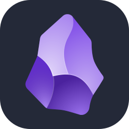

<!--
**fsancheZAr/fsancheZAr** is a ✨ _special_ ✨ repository because its `README.md` (this file) appears on your GitHub profile.

Here are some ideas to get you started:

- 🔭 I’m currently working on ...
- 🌱 I’m currently learning ...
- 👯 I’m looking to collaborate on ...
- 🤔 I’m looking for help with ...
- 💬 Ask me about ...
- 📫 How to reach me: ...
- 😄 Pronouns: ...
- ⚡ Fun fact: ...
-->
 
 
 

<h1 align="center">Hi, I'm <a href="">Fernando</a>!</h1>

<h3 align="center">Welcome to my GitHub profile 📫</h3>

# About ME 💬 :

### - I'm an Enthusiastic of Learning and software engineering, I am from Mexico..

### - Learning :
- ✨ Data Structures & Algorithms
- ✨ cybersecurity
- ✨ software engineering

 
 
 

# Languages & Tools 👨‍💻 🛠:
 

<!-- Row 1 -->

<!-- Row 2 -->

<!-- Row 3 -->

<!-- Row 4 -->

 

<!-- Row 5 -->

 

<!-- Row 6 -->

 
 

# Contact Me :

 

If you want to reach out to me about anything, be it some doubt or just to hangout and talk or want to game together just ping me 😉.

  
 
 
 
</a>

  
  
  

*************